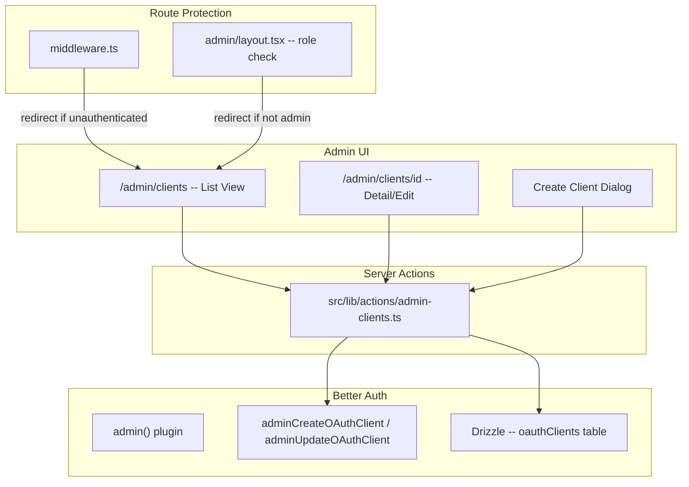

# Admin Panel for OAuth Client Management

## Architecture Overview



## 1. Add Better Auth Admin Plugin

**[src/lib/auth.ts](src/lib/auth.ts)** -- Add `admin()` plugin:

```typescript
import { admin } from "better-auth/plugins"

// Inside plugins array:
admin(),
```

**[src/lib/auth-client.ts](src/lib/auth-client.ts)** -- Add `adminClient()`:

```typescript
import { adminClient } from "better-auth/client/plugins"

// Inside plugins array:
adminClient(),
```

Run `pnpm db:sync` to regenerate the schema (adds `role` column to `users` table) and run migrations.

After migration, manually promote the first admin user in the database:
```sql
UPDATE users SET role = 'admin' WHERE email = 'your@email.com';
```

## 2. Add Required shadcn/ui Components

Install components needed for the admin panel:

- `input`, `label`, `card`, `table`, `dialog`, `badge`, `separator`, `select`, `checkbox`, `textarea`, `switch`, `tooltip`

Using `npx shadcn@latest add <component>`.

## 3. Server Actions

Create **[src/lib/actions/admin-clients.ts](src/lib/actions/admin-clients.ts)** with:

- **`getClients()`** -- Query `oauthClients` table via Drizzle (list all clients)
- **`getClient(id)`** -- Get single client by ID
- **`createClient(data)`** -- Call `auth.api.adminCreateOAuthClient()` with form data; return the generated `clientId` + `clientSecret` (shown once)
- **`updateClient(id, data)`** -- Call `auth.api.adminUpdateOAuthClient()` for fields like name, redirectUris, scopes, disabled, skipConsent, etc.
- **`deleteClient(id)`** -- Delete from `oauthClients` table via Drizzle
- **`toggleClient(id, disabled)`** -- Toggle the `disabled` flag
- **`rotateClientSecret(clientId)`** -- Generate a new secret; return it (shown once)

Each action will:
1. Get the current session via `auth.api.getSession()`
2. Verify `session.user.role === "admin"`
3. Execute the operation

## 4. Admin Pages

### Layout: [src/app/admin/layout.tsx](src/app/admin/layout.tsx)
- Server component that checks session + admin role
- Redirects to `/auth/sign-in` if not authenticated, or `/` if not admin
- Renders a minimal admin shell (heading + breadcrumbs)

### Redirect: [src/app/admin/page.tsx](src/app/admin/page.tsx)
- Redirects to `/admin/clients`

### Client List: [src/app/admin/clients/page.tsx](src/app/admin/clients/page.tsx)
- Server component that fetches all clients via `getClients()`
- Renders a table with columns: Name, Client ID, Type, Status (active/disabled), Created, Actions
- "New Client" button opens a create dialog (client component)
- Each row has a dropdown with: View/Edit, Toggle enabled, Delete
- Client component for the create dialog that shows the generated secret once

### Client Detail/Edit: [src/app/admin/clients/[id]/page.tsx](src/app/admin/clients/[id]/page.tsx)
- Server component that fetches client via `getClient(id)`
- Renders an edit form with all configurable fields grouped into sections:
  - **Basic**: Name, URI, Icon URL
  - **OAuth Config**: Redirect URIs (multi-input), Scopes (checkbox group), Grant Types, Response Types
  - **Behavior**: Skip Consent, Enable End Session, Require PKCE, Public client, Disabled
  - **Legal/Contact**: Contacts, Terms URL, Privacy URL
- Save button calls `updateClient()` server action
- "Rotate Secret" button with confirmation dialog
- "Delete Client" button with confirmation dialog

## 5. Admin Components

Create under `src/components/admin/`:

- **`client-table.tsx`** -- Table component with actions dropdown per row
- **`create-client-dialog.tsx`** -- Dialog with form for new client creation + secret reveal step
- **`client-form.tsx`** -- Reusable form fields for the edit page
- **`delete-client-dialog.tsx`** -- Confirmation dialog for deletion
- **`redirect-uri-input.tsx`** -- Multi-value input for redirect URIs

## 6. Route Protection

**[src/middleware.ts](src/middleware.ts)** -- Add `/admin` to protected routes:

```typescript
const protectedRoutes = ["/account/settings", "/admin"]
```

Update the matcher to include `/admin/:path*`.

## 7. Header Update

**[src/components/header.tsx](src/components/header.tsx)** -- Conditionally show an "Admin" link when the user has the admin role. This requires making it a client component or using a server-side session check and passing the role as a prop.

## Key Decisions

- **Secret display**: Client secrets are shown exactly once after creation or rotation, in a copyable dialog. They cannot be retrieved later.
- **OAuth client fields** map directly to the existing `oauthClients` schema -- no schema changes needed beyond the admin plugin's `role` column.
- **Admin guard** is enforced at two levels: middleware (authentication) and layout (role check).
- The existing `oauthClients` Drizzle table and `auth.api.adminCreateOAuthClient` / `auth.api.adminUpdateOAuthClient` are used directly -- no custom API routes needed.
