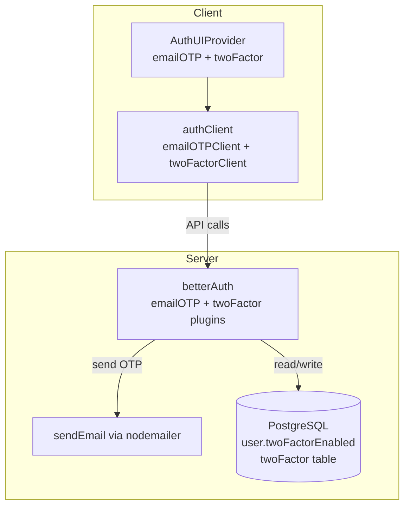

# Add Email OTP and 2FA Support

## Current State

- Server auth config: [src/lib/auth.ts](src/lib/auth.ts) -- has `emailAndPassword`, `passkey`, `admin`, etc. No OTP/2FA plugins.
- Client auth config: [src/lib/auth-client.ts](src/lib/auth-client.ts) -- no OTP/2FA client plugins.
- UI provider: [src/app/providers.tsx](src/app/providers.tsx) -- `AuthUIProvider` with `passkey` enabled. No `emailOTP` or `twoFactor` props.
- Email utility: [src/lib/email.ts](src/lib/email.ts) -- nodemailer-based `sendEmail()` already working.
- The `@daveyplate/better-auth-ui` library already ships email OTP forms, 2FA verification forms, 2FA settings cards, and recover-account forms. They activate when the provider props are set.

## Changes

### 1. Server config -- add `emailOTP` and `twoFactor` plugins

In [src/lib/auth.ts](src/lib/auth.ts):

- Import `emailOTP` and `twoFactor` from `"better-auth/plugins"` (alongside existing `admin`, `jwt`, `openAPI` imports).
- Add `emailOTP()` plugin with `sendVerificationOTP` calling the existing `sendEmail()` helper for all OTP types (sign-in, email-verification, forget-password).
- Add `twoFactor()` plugin with `otpOptions.sendOTP` calling `sendEmail()` to deliver the 2FA OTP code.

### 2. Client config -- add `emailOTPClient` and `twoFactorClient`

In [src/lib/auth-client.ts](src/lib/auth-client.ts):

- Import `emailOTPClient` and `twoFactorClient` from `"better-auth/client/plugins"`.
- Add `emailOTPClient()` to the plugins array.
- Add `twoFactorClient({ twoFactorPage: "/auth/two-factor" })` to the plugins array -- this redirects users to the built-in 2FA verification page when they sign in with 2FA enabled.

### 3. UI provider -- enable `emailOTP` and `twoFactor` props

In [src/app/providers.tsx](src/app/providers.tsx):

- Add `emailOTP` prop to `AuthUIProvider` (enables the email OTP sign-in button/form in auth views).
- Add `twoFactor={["totp", "otp"]}` prop (enables TOTP + OTP as 2FA methods; shows the 2FA settings card on the security page).

### 4. Database migration

The 2FA plugin requires:
- A `twoFactorEnabled` boolean column on the `user` table.
- A new `twoFactor` table (`id`, `userId`, `secret`, `backupCodes`, `verified`, `failedVerificationCount`, `lockedUntil`).

Run the existing sync script which regenerates the auth schema and applies migrations:

```bash
pnpm db:sync
```

This runs `npx auth generate -y && npx drizzle-kit generate && npx drizzle-kit migrate`.

### 5. PostHog tracking (optional enhancement)

In [src/lib/auth-client.ts](src/lib/auth-client.ts), add new auth event path mappings for OTP/2FA events:

```typescript
"/sign-in/email-otp": "email_otp_sign_in",
"/two-factor/verify-totp": "2fa_totp_verified",
"/two-factor/enable": "2fa_enabled",
"/two-factor/disable": "2fa_disabled",
```

## Architecture



## Files Modified

- [src/lib/auth.ts](src/lib/auth.ts) -- add `emailOTP` and `twoFactor` plugins
- [src/lib/auth-client.ts](src/lib/auth-client.ts) -- add `emailOTPClient` and `twoFactorClient`
- [src/app/providers.tsx](src/app/providers.tsx) -- add `emailOTP` and `twoFactor` props
- [auth-schema.ts](auth-schema.ts) -- auto-regenerated by `npx auth generate`
- Drizzle migration files -- auto-generated by `npx drizzle-kit generate`
