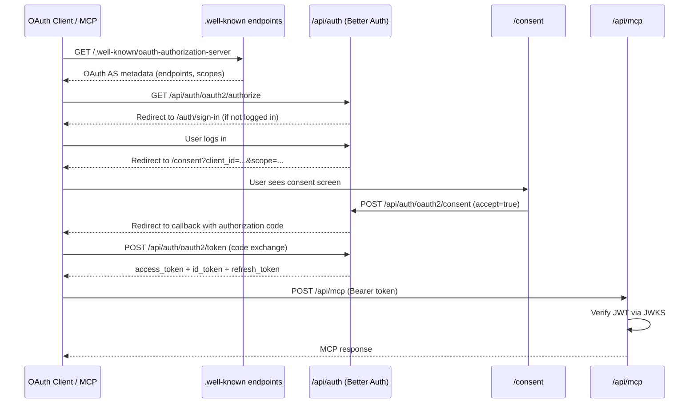

# Complete OAuth 2.1 Provider Setup

## Current State

Already done:
- `@better-auth/oauth-provider` v1.5.6 installed
- `oauthProvider()` mounted in [src/lib/auth.ts](src/lib/auth.ts) with `jwt()` plugin
- `oauthProviderClient()` in [src/lib/auth-client.ts](src/lib/auth-client.ts)
- `oauthProviderResourceClient(auth)` in [src/lib/server-client.ts](src/lib/server-client.ts)
- Database schema with all OAuth tables (`oauthClients`, `oauthRefreshTokens`, `oauthAccessTokens`, `oauthConsents`) in [auth-schema.ts](auth-schema.ts)
- Migrations run

## Issues to Fix

### 1. Fix auth config (`src/lib/auth.ts`)

- **`loginPage` mismatch**: Currently `/login`, but app uses `/auth/sign-in` -- change to `/auth/sign-in`
- **Add `disabledPaths: ["/token"]`** at the `betterAuth()` level (docs recommend this to avoid conflict with Better Auth's own token endpoint)
- **Add scopes**: `["openid", "profile", "email", "offline_access"]` (standard OIDC scopes)
- **Add `validAudiences`**: Set to the app's API URL (e.g. from `BETTER_AUTH_URL` env var or a dedicated `OAUTH_AUDIENCE` env)
- **Enable dynamic client registration** with `allowDynamicClientRegistration: true` and `allowUnauthenticatedClientRegistration: true` (required for MCP clients like ChatGPT/Claude to self-register)
- **Enable `allowPublicClientPrelogin: true`** so public clients can fetch client info before login

## New Files to Create

### 2. Consent Page (`src/app/consent/page.tsx`)

Create a consent screen that:
- Reads `client_id` and `scope` from query params (provided by the OAuth flow redirect)
- Fetches client info via `authClient.oauth2.publicClient({ query: { client_id } })`
- Displays client name, icon, and requested scopes in a card layout
- Has "Allow" and "Deny" buttons that call `authClient.oauth2.consent({ accept: true/false })`
- Uses existing UI components (`Button` from `src/components/ui/button.tsx`) and matches the app's Tailwind styling

### 3. Well-Known Discovery Routes

Three route files using the helpers from `@better-auth/oauth-provider`:

- **`src/app/.well-known/openid-configuration/route.ts`** -- OIDC discovery metadata via `oauthProviderOpenIdConfigMetadata(auth)`
- **`src/app/.well-known/oauth-authorization-server/route.ts`** -- RFC 8414 OAuth AS metadata via `oauthProviderAuthServerMetadata(auth)`
- **`src/app/.well-known/oauth-protected-resource/route.ts`** -- Protected resource metadata for MCP via `serverClient.getProtectedResourceMetadata()`

Each is a simple `GET` handler that returns JSON. Add CORS headers (`Access-Control-Allow-Origin: *`, `Access-Control-Allow-Methods: GET`) for local MCP testing compatibility.

### 4. MCP Handler Route (`src/app/api/mcp/[transport]/route.ts`)

- Install `mcp-handler` and `zod` dependencies
- Create an MCP transport route using the `mcpHandler` helper from `@better-auth/oauth-provider`
- Wire up `verifyOptions` with `issuer` and `audience` from env vars
- Include a sample `echo` tool to verify the setup works
- Export `GET`, `POST`, `DELETE` handlers

### 5. Create First OAuth Client Script (`scripts/create-oauth-client.ts`)

A runnable script (`npx tsx scripts/create-oauth-client.ts`) that:
- Imports the `auth` instance
- Calls `auth.api.adminCreateOAuthClient()` to create a confidential client with `skip_consent: true` and `enable_end_session: true`
- Logs the `client_id` and `client_secret` for the user to save

### 6. Environment Variables

Add to [.env.example](.env.example):
- `OAUTH_AUDIENCE` -- the resource server audience URL (e.g. `https://api.example.com`)
- `OAUTH_ISSUER` -- the issuer URL if different from `BETTER_AUTH_URL`

### 7. Middleware Update (`src/middleware.ts`)

Add `/consent` to the `protectedRoutes` array so unauthenticated users hitting the consent page get redirected to sign in first (consent requires an active session).

## Architecture Flow

